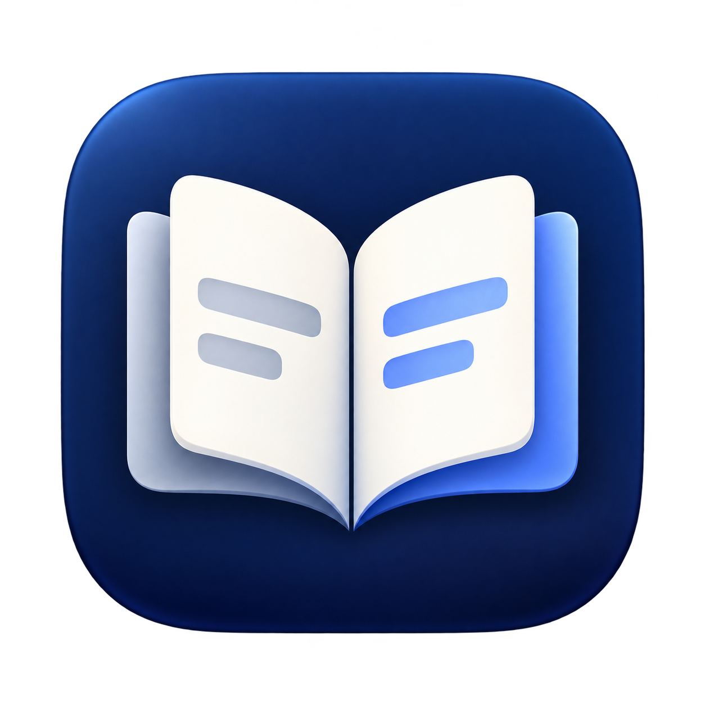
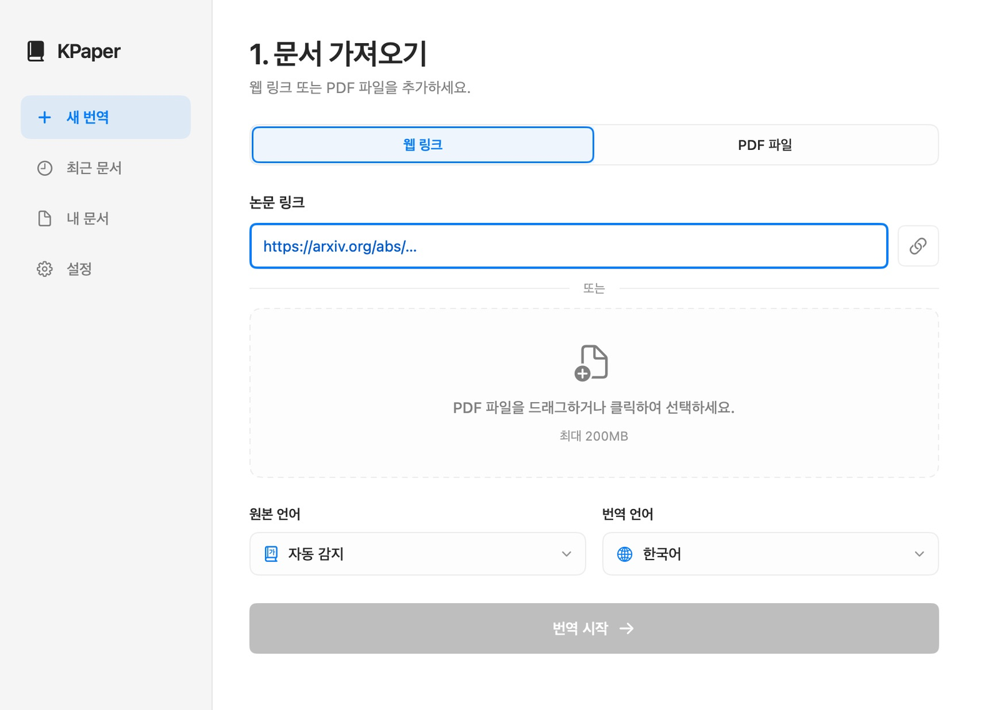
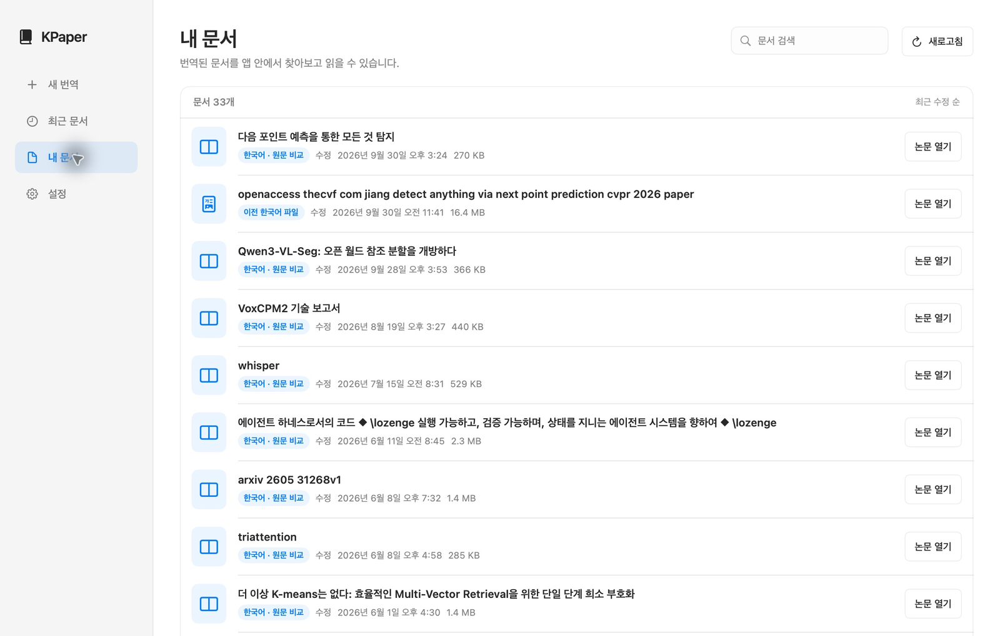
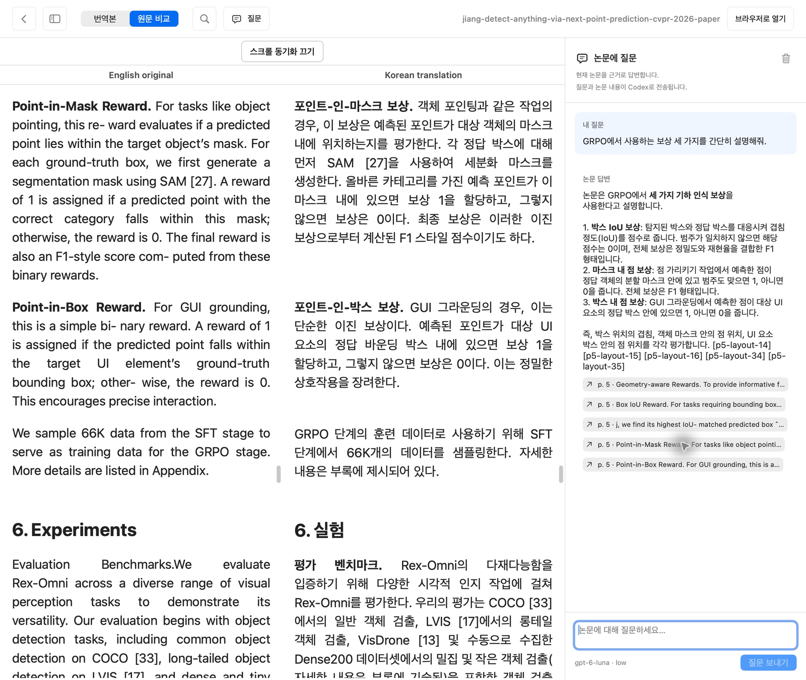

# KPaper — Mac용 논문 리더



**Apple Silicon Mac용 앱입니다. 논문의 구조를 유지한 채 한국어로 읽고, 원문과 비교하며, 논문에 질문할 수 있습니다.**

> 지원 환경: Apple Silicon Mac. Windows용 앱은 제공하지 않으며, Intel Mac의 전체 파이프라인은 검증하지 않았습니다.

논문을 요약문으로 바꾸는 대신 본문을 충실하게 번역하고 그림·표·수식·인용을 함께 보존합니다. ar5iv HTML을 우선 사용하며, HTML이 없는 논문은 PDF에서 읽기 순서와 레이아웃을 추출합니다. 네이티브 SwiftUI 앱과 CLI는 같은 `uv` 기반 번역 파이프라인을 사용합니다.

현재 앱 릴리스는 **0.3.1, 빌드 6**입니다. 변경 이력은 [릴리스 반영 사항](RELEASE_NOTES.md)을 확인하세요.

## 앱에서 사용하는 흐름

### 1. 논문 가져오기

arXiv/ar5iv 링크를 입력하거나 로컬 PDF를 끌어다 놓습니다. 원문을 준비한 뒤 구조 분석, 번역, 리더 스타일 적용 순서로 처리하며 앱에서 진행 상태와 오류를 확인할 수 있습니다. 번역 캐시를 사용하므로 이미 처리한 블록을 재사용할 수 있습니다.



*가져오기 화면의 주요 영역입니다. 링크와 PDF를 같은 화면에서 시작합니다. HTML을 사용할 수 있는 논문은 HTML 구조를 유지하고, PDF는 본문과 시각 자료를 추출합니다.*

### 2. 문서 목록에서 이어 읽기

같은 논문의 출력 파일을 한 항목으로 묶어 보여줍니다. 제목을 검색해 문서를 찾고, 최근 문서에서 마지막에 읽은 논문을 다시 열 수 있습니다. 읽던 위치와 보기 모드는 논문별로 저장하며, 로컬 원본 PDF가 있으면 목록에서 열 수 있습니다.



*논문 제목을 중심으로 문서를 찾습니다. 최근 문서는 마지막 열람 순서로 최대 50개 논문을 표시합니다.*

### 3. 한국어 본문 읽기

목차로 절을 이동하고 현재 읽는 절을 확인합니다. `⌘F`로 본문을 검색해 일치하는 구절 사이를 이동할 수 있습니다. 목차 접기와 문서 목록으로 돌아가기는 별도 동작입니다.


*절 제목은 본문보다 크고 굵게, 문단 앞의 짧은 소제목은 굵게 표시합니다. 긴 논문 제목도 화면 안에서 줄바꿈됩니다.*

그림과 표는 본문 흐름 안에 유지합니다. PDF 수식은 원본 영역 이미지로 보존하여 깨진 LaTeX 문자열이 본문에 흩어지는 문제를 줄입니다. 참고문헌은 번역 대상에서 제외하고 원문으로 유지하며, 기본적으로 닫힌 아코디언에서 필요할 때 펼칩니다. 원본 HTML의 링크·인용·코드·수학 블록을 보호하고, 표 HTML은 번역하지 않은 원본을 복원합니다.

### 4. 원문과 나란히 비교

앱의 `원문 비교`로 왼쪽 영어 원문과 오른쪽 한국어 번역을 비교합니다. 앱 리더는 두 열을 유지합니다. 브라우저에서는 `원본 보기`로 전환하며, 좁은 화면에서는 세로로 배치됩니다.


*대응하는 제목·문단·그림을 기준으로 스크롤 위치를 계산합니다. 영문과 번역문의 길이가 달라도 같은 내용을 따라 읽기 쉽도록 이동량을 조정합니다.*

스크롤 동기화는 기본적으로 켜져 있습니다. 끄면 양쪽을 따로 읽을 수 있으며, 다시 켜도 현재 위치가 갑자기 이동하지 않습니다. 이후 스크롤부터 연결됩니다. 이미지 로딩, 창 크기 변경, 참고문헌 펼치기로 레이아웃이 달라지면 정렬 기준을 다시 계산합니다.

### 5. 논문에 질문

리더에서 `논문에 질문`을 눌러 현재 논문에 대해 질문합니다. 답변은 한국어 Markdown으로 표시하며, 근거 버튼을 누르면 해당 문단으로 이동합니다. 대화는 논문별로 로컬에 저장하고, 실행 중 취소와 오류 확인을 지원합니다.



*논문에서 GRPO가 사용하는 세 가지 보상을 질문한 실제 응답입니다. 답변 아래의 근거를 선택해 설명의 출처를 본문에서 확인할 수 있습니다.*

질문 기능은 공식 `openai-codex` Python SDK와 Codex의 ChatGPT 로그인을 사용합니다. 기본 모델은 **`gpt-6-luna`**, 추론 강도는 **`low`**입니다. 질문·대화 문맥·파싱된 논문 텍스트와 최대 12개의 로컬 그림·수식 이미지를 Codex에 전달합니다. 외부 웹 검색은 사용하지 않습니다.

본문이 180,000자를 넘으면 질문과 관련된 발췌를 선택하고 모델에도 부분 문맥임을 알립니다. 파싱 결과가 없거나 읽을 수 없으면 오류를 표시합니다. 답변의 근거는 현재 논문의 실제 문단 ID와 대조합니다.

## 운영체제 지원 범위

현재 검증한 실행 환경은 **Apple Silicon Mac**입니다. 네이티브 앱과 로컬 OCR을 Windows에서도 같은 방식으로 실행할 수 있다는 의미는 아닙니다.

| 기능 | Apple Silicon Mac | Windows |
| --- | --- | --- |
| 네이티브 데스크톱 앱 | 빌드·실행 검증 완료 | Windows 앱 미제공. SwiftUI/AppKit/WebKit 기반 macOS 앱입니다. |
| Unlimited-OCR 로컬 분석 | MLX 백엔드 연결 및 PDF 파싱 검증 | 현재 MLX 백엔드는 지원하지 않습니다. 별도 OCR 실행 백엔드가 필요합니다. |
| Python CLI 설치·번역 | 현재 지원 환경 | 필수 `mlx-vlm` 의존성 및 셸 래퍼 때문에 현재 지원·검증하지 않습니다. |
| 생성된 한영 HTML 읽기 | 앱 또는 브라우저로 열람 | 웹 브라우저로 열람할 수 있는 HTML 형식입니다. Windows 실기기 검증은 하지 않았습니다. |

[uv는 Windows와 macOS를 지원](https://docs.astral.sh/uv/reference/policies/platforms/)하지만, KPaper의 모든 의존성과 앱이 두 운영체제를 지원하는 것은 아닙니다. 현재 로컬 OCR은 [Apple Silicon용 MLX](https://github.com/ml-explore/mlx)를 사용하는 `mlx-vlm` 경로입니다. Intel Mac도 현재 전체 파이프라인 지원 환경으로 검증하지 않았습니다.

Windows 지원을 추가하려면 MLX 의존성을 선택 설치로 분리하고, Windows용 OCR 백엔드와 실행 진입점을 마련해야 합니다. 네이티브 앱은 별도의 Windows UI 구현이 필요합니다.

## 설치와 인증

macOS 앱은 Swift 빌드 도구와 로컬 Python 실행 환경을 사용합니다. `uv`로 프로젝트 의존성을 설치하세요. Apple Silicon의 MLX OCR을 사용하는 PDF는 첫 실행 때 OCR 모델 준비 시간이 추가될 수 있습니다.

```bash
uv sync
```

`uv.lock`에 잠긴 Python 의존성에는 HTML 처리, PDF 분석·OCR, 공식 Codex SDK와 그 런타임이 포함됩니다. 앱 설정에서 프로젝트 경로를 확인하세요.

### Sign in with ChatGPT

앱 설정에서 **ChatGPT 로그인 → Continue with ChatGPT**를 선택합니다. 브라우저에서 계정과 워크스페이스를 선택하고 KPaper의 요금제 사용을 허용하면, API 키 없이 번역과 논문 질문을 사용할 수 있습니다. 연결된 계정을 바꾸거나 추가하고, **사용량 관리**에서 KPaper의 한도를 관리할 수 있습니다.

왼쪽 사이드바에서 오늘 토큰·요청 수와 최근 7일 선 그래프를 확인합니다. **상세 통계** 또는 설정의 **GPT 사용량**에서 오늘·최근 30일 토큰과 요청 수, 입력·출력 토큰 구성 게이지, 최근 7일 사용량을 확인합니다. 이 Mac의 KPaper가 서버에서 받은 토큰 수만 연결 계정별로 집계하며, 새 버전의 첫 요청부터 기록합니다. 앱을 사용하는 동안 10초마다 갱신하고, 조회에는 모델 호출이 필요하지 않습니다. 실패·중단된 요청도 서버가 보고한 토큰은 포함합니다. 사용량 기록에는 문서·질문·답변·인증 토큰을 저장하지 않습니다.

**Weekly usage**는 공식 [Codex app-server의 사용 한도 조회](https://learn.chatgpt.com/docs/app-server#6-rate-limits-chatgpt)로 기존 Codex 로그인 계정의 주간 잔량과 초기화 시간을 표시합니다. KPaper 연결 계정과 Codex 계정의 이메일이 일치할 때만 표시하며, 1분마다 갱신합니다. 모델을 호출하거나 KPaper의 OAuth 토큰을 Codex에 전달하지 않습니다. 계정이 다르거나 주간 값이 없으면 조회 불가 상태로 표시합니다. 이 게이지는 Codex 주간 한도이며, KPaper의 Sign in with ChatGPT 앱 한도와는 구분됩니다.

KPaper의 ChatGPT 앱 한도는 이 로그인 API가 제공하지 않습니다. 입력·출력 토큰 구성 게이지는 한도의 잔량·백분율을 의미하지 않으며, **사용량 관리**에서 계정·앱 한도를 확인할 수 있습니다. 공식 [사용량 안내](https://developers.openai.com/siwc/token-sharing-open-source/profiles-and-sessions#tracking-usage)와 [UI 지침](https://developers.openai.com/siwc/ui-ux-guidelines#link-to-chatgpt-usage)도 ChatGPT 사용량 설정으로 연결하도록 안내합니다.

이 기능은 OpenAI의 [오픈소스 앱용 Sign in with ChatGPT](https://developers.openai.com/siwc/token-sharing-open-source/sign-in)를 사용합니다. 계정별 모델 목록을 조회하고 선택한 모델로 `https://api.openai.com/v1/responses`를 호출합니다. 요청은 `store: false`, `stream: true`이며, 완료 이벤트를 받은 응답만 저장합니다. 이용 가능 여부는 계정·요금제·워크스페이스 정책에 따릅니다.

```bash
./kpaper chatgpt login --json
./kpaper chatgpt usage --json
./kpaper chatgpt weekly --json
./kpaper chatgpt status --json
./kpaper chatgpt models --json
./kpaper translate --paper-id my-paper --provider chatgpt
./kpaper chatgpt logout --json
```

KPaper의 연결은 Codex CLI 로그인과 별도로 관리합니다. 계정 정보와 OAuth 자격증명은 `~/Library/Application Support/KPaper/ChatGPT/`에 사용자만 읽을 수 있는 파일로 저장하며, 토큰을 로그나 저장소에 남기지 않습니다. 토큰 갱신은 병렬 번역 작업 사이에서 직렬화합니다. 로그아웃 후에도 계정 등록 정보와 호스트 ID를 유지해 다음 로그인에 재사용합니다.

### Codex CLI 구독

로컬 Codex CLI를 준비하고 앱 설정의 **Codex CLI → ChatGPT로 로그인** 또는 아래 명령으로 로그인합니다.

```bash
codex login
codex login status
```


*Codex CLI 방식의 로그인과 자격증명 관리는 Codex에 위임합니다. 이 방식은 KPaper 전용 Sign in with ChatGPT 연결과 별개입니다.*

앱의 Codex 번역 기본 모델은 `gpt-6-luna`, 추론 강도는 `low`입니다. CLI에서도 모델을 생략하면 같은 기본값을 사용하며 `--model`로 명시한 모델은 유지합니다.

```bash
./kpaper translate --paper-id my-paper --provider codex
```

### OpenAI 호환 API

API 방식은 별도로 지원합니다. 로컬 `.env` 파일을 만들고 제공받은 값을 입력하세요.

```bash
cp .env.example .env
```

```dotenv
OPENAI_API_KEY=...
OPENAI_BASE_URL=http://host:port/v1
```

CLI의 기본 provider는 `api`이며 기본 모델은 `gpt-5.4-mini`입니다. 앱 설정에서 API 주소·모델·임시 API 키를 지정할 수 있고, 입력을 비우면 `.env` 값을 사용합니다. 논문 질문 기능은 API 설정과 별개로 Codex 로그인이 필요합니다.

### 앱 내려받기

[GitHub 릴리스](https://github.com/ColdTbrew/KPaper/releases/latest)에서 Apple Silicon Mac용 DMG 또는 ZIP을 내려받을 수 있습니다. DMG에서 `KPaper.app`을 Applications 폴더로 복사하세요.

배포 앱은 Python 번역·OCR 엔진을 내장하지 않습니다. 저장소를 내려받고 `uv sync`로 실행 환경을 준비한 뒤, 앱 설정의 프로젝트 경로를 해당 저장소 폴더로 지정해야 합니다. 앱은 ad hoc 서명이며 Apple 공증은 적용하지 않았습니다.

### 앱 빌드

```bash
./scripts/build_macos_app.sh
open dist/KPaper.app
```

빌드 스크립트는 Swift 네이티브 빌드 시스템을 사용하고, Info.plist 검사와 로컬 실행용 ad hoc 서명·검증을 수행합니다. 기본 SDK가 현재 Swift 컴파일러에 없는 매크로를 요구하면 다른 설치된 SDK로 재시도합니다. SDK를 직접 지정할 수도 있습니다.

```bash
KPAPER_SWIFT_SDK="$(xcrun --sdk macosx --show-sdk-path)" ./scripts/build_macos_app.sh
```

배포용 DMG·ZIP과 SHA-256 체크섬은 `./scripts/package_macos_release.sh`로 생성합니다.

명시한 SDK는 자동으로 바꾸지 않습니다. 생성한 앱은 로컬 사용용이며 App Store 배포·공증을 뜻하지 않습니다.

## CLI 사용

모든 주요 명령은 `--json`을 지원합니다. 먼저 로컬 환경을 확인합니다.

```bash
./kpaper doctor --json
```

### arXiv 링크로 한 번에 가져오기

arXiv 링크나 ID만 주면 `import`가 소스를 알아서 고릅니다. `abs`, `pdf`, `html`, ar5iv 주소와 `1706.03762` 같은 ID를 모두 받습니다.

```bash
./kpaper import https://arxiv.org/abs/1706.03762
./kpaper translate --paper-id arxiv-1706-03762 --provider codex
```

1. `arxiv.org/html/<id>`(arXiv 공식 HTML)를 시도합니다.
2. 없거나 변환에 실패했으면 `ar5iv.labs.arxiv.org/html/<id>`를 시도합니다.
3. 둘 다 안 되면 `arxiv.org/pdf/<id>`를 내려받아 `pdf-import`와 같은 방식으로 레이아웃을 추출합니다.

HTML 응답은 논문 본문(`ltx_document`와 본문 문단)이 있을 때만 사용합니다. 결과 JSON의 `route`(`arxiv-html`, `ar5iv`, `pdf`)와 `attempts`에서 어느 경로를 썼고 앞 경로가 왜 건너뛰어졌는지 볼 수 있습니다. `--paper-id`를 생략하면 `arxiv-<id>`(예: `arxiv-1706-03762`)를 사용합니다. `--source html`은 PDF로 넘어가지 않고, `--source pdf`는 HTML을 건너뜁니다. `--dry-run`은 네트워크 요청 없이 시도할 주소만 보여줍니다.

### ar5iv HTML 가져오기와 번역

주소를 직접 지정해 HTML 하나만 내려받으려면 `fetch`를 사용합니다.

```bash
./kpaper fetch \
  --paper-id mmdocrag \
  --source-url https://ar5iv.labs.arxiv.org/html/2505.16470v2

./kpaper translate --paper-id mmdocrag --provider codex --dry-run
./kpaper translate --paper-id mmdocrag --provider codex
```

`--dry-run`은 블록 수와 번역할 분량을 확인하며 번역 모델을 호출하지 않습니다. `translate --source-url`로 가져오기와 번역을 연결할 수도 있습니다.

### PDF 가져오기와 번역

로컬 PDF 또는 PDF URL을 소스 HTML로 변환한 다음 같은 번역 명령을 사용합니다.

```bash
./kpaper pdf-import \
  --paper-id my-paper \
  --pdf /path/to/paper.pdf \
  --title "논문 제목" \
  --layout-backend auto

./kpaper translate --paper-id my-paper --provider codex --dry-run
./kpaper translate --paper-id my-paper --provider codex
```

원격 PDF는 `--pdf` 대신 `--pdf-url`을 지정합니다. Hugging Face의 `/blob/…` URL은 다운로드 가능한 `/resolve/…` URL로 변환합니다.

기본 `auto` 백엔드는 `pdf-inspector`로 페이지를 분류합니다. Unlimited-OCR은 디지털 페이지에서도 그림·표·차트·수식 영역과 읽기 순서를 분석합니다. 원문 텍스트가 있는 페이지는 PDF에서 직접 추출한 본문을 우선 사용하고, Unlimited-OCR이 찾은 시각 자료 영역과 결합합니다. OCR이 필요한 페이지는 모델이 추출한 본문과 레이아웃을 사용합니다. 시각 자료는 원본 영역을 잘라 본문 사이에 배치합니다. `--layout-backend native`와 `--layout-backend unlimited-ocr-mlx`는 특정 경로를 강제할 때 사용합니다.

이미지는 한 페이지씩 생성하고, 일반 텍스트만 있는 디지털 페이지는 모델을 생략합니다. 스캔·그림·벡터 도형·수식 페이지는 grounded 분석을 유지합니다. 모델의 이미지 조각과 SAM attention은 메모리를 제한하며 계산하고, 같은 사용자의 KPaper OCR은 한 번에 하나씩 실행합니다. 완료된 결과는 `inputs/assets/<paper-id>/layout/cache/`에 이미지·모델 버전·토큰 설정별로 저장해 재시도에서 재사용합니다. 분석 종료·오류 시 모델과 Metal 캐시를 해제합니다. `--json`의 `native_only_pages`, `ocr_runtime`에서 모델 생략 페이지, 생성·캐시 재사용 페이지 수와 MLX 최대 메모리를 확인할 수 있습니다.

최적화 측정과 Swift·GGUF·4bit 대안의 비교는 [OCR 메모리 최적화](docs/OCR_OPTIMIZATION.md)를 참고하세요.

### 결과 파일과 스타일 갱신

생성하는 리더는 **`outputs/<논문 제목 기반 파일명>.ko-en.paper.html` 하나**입니다. 제목을 파일명으로 정규화하며, 제목을 사용할 수 없는 경우 논문 ID를 사용합니다. 같은 파일에서 한국어 보기와 한영 비교를 전환합니다.

```text
inputs/<paper-id>.source.html
inputs/pdfs/<paper-id>.pdf                 # PDF를 가져온 경우
inputs/assets/<paper-id>/                 # PDF 그림·표·수식 이미지 등
outputs/<논문 제목 기반 파일명>.ko-en.paper.html
outputs/cache/<paper-id>.masked.translation.jsonl
```

기존 `*.ko.paper.html`은 계속 읽을 수 있지만 새로 생성하거나 덮어쓰지 않습니다. 스타일만 바꾸거나 원본 표·수식을 복원하려면 번역을 반복하지 않고 다음 명령을 사용합니다.

```bash
./kpaper restyle --paper-id my-paper
```

통합 리더가 없으면 기존 한국어 파일을 입력으로 사용할 수 있으며 결과는 통합 파일에 저장합니다. 갱신 뒤 앱에서 다시 열거나 브라우저를 새로고침하세요.

### 브라우저에서 열기

```bash
./kpaper serve --port 8799
```

출력 파일의 실제 이름으로 `http://127.0.0.1:8799/outputs/<파일명>.ko-en.paper.html`을 엽니다.

## 개발과 저장 정책

`.env`, `inputs/`, `outputs/`, `.venv/`, 캐시는 로컬 데이터이며 Git에 포함하지 않습니다. README용 `docs/*.png` 스크린샷은 버전 관리합니다. 번역 결과를 외부에 공유할 때는 원문과 번역물의 배포 권한을 확인하세요.

작업 가이드는 [AGENTS.md](AGENTS.md), [CLAUDE.md](CLAUDE.md), [kpaper 스킬](skills/kpaper/SKILL.md)에 있습니다. 구조 보존과 CLI 구현은 `scripts/`, 네이티브 앱은 `macos-app/`에 있습니다.

```bash
uv run python -m unittest discover -s tests
uv run python -m py_compile scripts/*.py
./scripts/build_macos_app.sh
```
